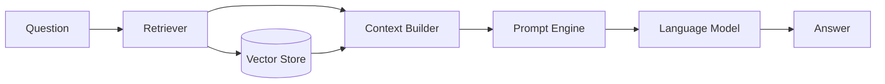

# RAG System Architecture

> Technical documentation for the Retrieval Augmented Generation system implementation

## System Overview



## Components

### 1. Vector Store (ChromaDB)

#### Configuration
```python
EMBEDDING_MODEL = "sentence-transformers/paraphrase-multilingual-mpnet-base-v2"
COLLECTION_NAME = "turkish_criminal_law"
```

#### Collections
- `turkish_criminal_law`: Law articles and provisions
- `turkish_legal_terms`: Legal terminology

#### Embedding Process
1. Text preprocessing
2. Multilingual embedding
3. Dimension reduction
4. Index creation

### 2. Retriever

#### Implementation
```python
def retrieve(
    self,
    query: str,
    n_results: int = 5,
    metadata_filter: Optional[Dict[str, str]] = None
) -> List[Dict]:
    """
    Retrieve relevant documents based on semantic similarity.
    
    Args:
        query: Search query
        n_results: Number of results to return
        metadata_filter: Optional filters
        
    Returns:
        List of relevant documents with metadata
    """
```

#### Search Strategy
1. Query preprocessing
2. Semantic search
3. Metadata filtering
4. Result ranking

### 3. Context Builder

#### Context Formation
1. Document aggregation
2. Relevance sorting
3. Context window management
4. Term integration

#### Example
```python
def format_context(self, retrieved_docs: List[Dict]) -> str:
    """Format retrieved documents into a context string."""
    context_parts = []
    
    for doc in retrieved_docs:
        if doc['metadata']['type'] == 'article':
            context_parts.append(
                f"Madde {doc['metadata']['number']}: {doc['content']}"
            )
        elif doc['metadata']['type'] == 'legal_term':
            context_parts.append(doc['content'])
    
    return "\n\n".join(context_parts)
```

### 4. Prompt Engine

#### Template Types
1. Basic Legal Prompt
2. Structured Legal Prompt
3. Multi-step Reasoning Prompt

#### Prompt Structure
```
[SYSTEM CONTEXT]
Sen Türk Ceza Kanunu konusunda uzmanlaşmış bir hukuk asistanısın.

[RETRIEVED CONTEXT]
{formatted_context}

[QUESTION]
{question}

[INSTRUCTIONS]
1. SORU KAPSAMI
2. İLGİLİ KANUN MADDELERİ
3. HUKUKİ ANALİZ
4. SONUÇ
```

## Performance Optimization

### Vector Store
- Batch processing for embeddings
- Periodic index optimization
- Caching frequently accessed entries

### Retrieval
- Query expansion
- Hybrid search (semantic + keyword)
- Dynamic result count

### Context Building
- Adaptive context window
- Smart truncation
- Term prioritization

## Monitoring and Maintenance

### Metrics
- Retrieval latency
- Context relevance
- Answer quality
- System resource usage

### Maintenance Tasks
1. Regular index updates
2. Performance monitoring
3. Model updates
4. Data validation

## Error Handling

### Common Issues
1. Token limit exceeded
2. Embedding errors
3. Context formation failures
4. LLM API errors

### Recovery Strategies
1. Automatic retries
2. Fallback options
3. Graceful degradation
4. User feedback

## Future Improvements

### Planned Enhancements
1. Multi-stage retrieval
2. Dynamic prompt selection
3. Context refinement
4. Answer validation

### Research Areas
1. Few-shot learning
2. Cross-lingual retrieval
3. Answer consistency
4. Context optimization 