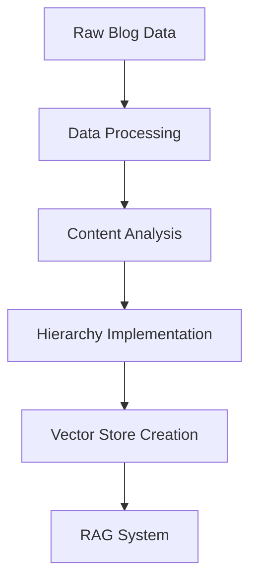

# Development Tools

This directory contains various tools and utilities for the Turkish Legal AI system, organized by functionality.

## Directory Structure

```
tools/
├── data_processing/           # Data processing pipeline tools
│   ├── filter_criminal_law_articles.py
│   ├── clean_criminal_law_articles.py
│   ├── analyze_criminal_law_content.py
│   └── README.md
├── vector_store/             # Vector store management tools
│   ├── create_vector_store.py
│   └── README.md
├── hierarchy/                # Hierarchy implementation tools
│   ├── implement_hierarchy.py
│   └── README.md
└── README.md                 # This file
```

## Tool Categories

### 1. Data Processing Tools

Tools for processing raw data into structured formats.

- [Documentation](data_processing/README.md)
- Input: Raw blog articles
- Output: Processed and analyzed articles

### 2. Vector Store Tools

Tools for managing ChromaDB vector stores.

- [Documentation](vector_store/README.md)
- Input: Processed articles
- Output: Vector embeddings and collections

### 3. Hierarchy Tools

Tools for implementing content hierarchy.

- [Documentation](hierarchy/README.md)
- Input: Analyzed articles
- Output: Hierarchical structure and validation

## Complete Pipeline



## Usage

### 1. Process Raw Data

```bash
# 1. Filter articles
python -m tools.data_processing.filter_criminal_law_articles

# 2. Clean articles
python -m tools.data_processing.clean_criminal_law_articles

# 3. Analyze content
python -m tools.data_processing.analyze_criminal_law_content
```

### 2. Implement Hierarchy

```bash
python -m tools.hierarchy.implement_hierarchy
```

### 3. Create Vector Store

```bash
python -m tools.vector_store.create_vector_store
```

## Development Guidelines

### Adding New Tools

1. Choose appropriate category directory
2. Create tool script
3. Add comprehensive documentation
4. Update category README
5. Update this README

### Code Style

- Follow PEP 8
- Add type hints
- Include docstrings
- Add error handling
- Include logging

### Testing

- Add unit tests
- Include integration tests
- Test with sample data
- Document test cases

## Data Flow

### Input Data

- Raw blog articles (CSV)
- Turkish Criminal Code (JSON)
- Legal terminology (JSON)

### Intermediate Data

- Filtered articles
- Cleaned content
- Analyzed metadata
- Hierarchical structure

### Output Data

- Vector store collections
- Validation results
- Processing logs
- Error reports

## Maintenance

### Regular Tasks

- Update documentation
- Verify data flow
- Check error logs
- Monitor performance
- Update dependencies

### Error Handling

- Log all errors
- Implement retries
- Validate outputs
- Report issues

## Dependencies

### Python Packages

- pandas
- chromadb
- beautifulsoup4
- sentence-transformers
- numpy
- typing
- json

### System Requirements

- Python 3.9+
- Sufficient disk space
- Adequate RAM (8GB+)
- Internet connection

## Support

For issues or questions:

1. Check documentation
2. Review error logs
3. Open GitHub issue
4. Contact maintainers
