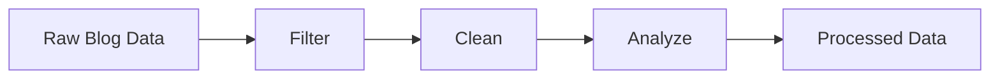

# Data Processing Tools

This directory contains tools for processing Turkish Criminal Law articles and preparing them for the RAG system.

## Processing Pipeline



## Tools

### 1. filter_criminal_law_articles.py

Filters criminal law articles from the raw blog data.

**Input**: `data/raw/barandogan_blog_scraped/barandogan_articles_*.csv`
**Output**: `data/processed/criminal_law/criminal_law_articles.csv`

```bash
python -m tools.data_processing.filter_criminal_law_articles
```

### 2. clean_criminal_law_articles.py

Cleans and preprocesses the filtered articles.

**Input**: `data/processed/criminal_law/criminal_law_articles.csv`
**Output**: `data/processed/criminal_law/cleaned_criminal_law_articles.csv`

```bash
python -m tools.data_processing.clean_criminal_law_articles
```

### 3. analyze_criminal_law_content.py

Analyzes content and extracts metadata from cleaned articles.

**Input**: `data/processed/criminal_law/cleaned_criminal_law_articles.csv`
**Output**:

- `data/processed/criminal_law/analyzed_criminal_law_articles.csv`
- `data/processed/criminal_law/content_analysis_metadata.json`

```bash
python -m tools.data_processing.analyze_criminal_law_content
```

## Data Flow

1. **Raw Data** (`/data/raw/`)

   - Original blog articles
   - Unprocessed content
   - Multiple categories

2. **Filtered Data**

   - Only criminal law articles
   - Original content preserved
   - Basic metadata

3. **Cleaned Data**

   - HTML removed
   - Formatting fixed
   - Navigation elements removed
   - Empty content filtered

4. **Analyzed Data**
   - TCK references extracted
   - Legal terms identified
   - Topics categorized
   - Metadata enriched

## Usage

Run the complete pipeline:

```bash
# 1. Filter articles
python -m tools.data_processing.filter_criminal_law_articles

# 2. Clean articles
python -m tools.data_processing.clean_criminal_law_articles

# 3. Analyze content
python -m tools.data_processing.analyze_criminal_law_content
```

## Validation

Each step includes validation:

- Filter: Ensures only criminal law articles are selected
- Clean: Validates content quality and length
- Analyze: Verifies metadata extraction and references

## Dependencies

- pandas
- beautifulsoup4
- regex
- json

## Error Handling

All scripts include:

- Input file validation
- Output directory creation
- Exception handling
- Progress logging
