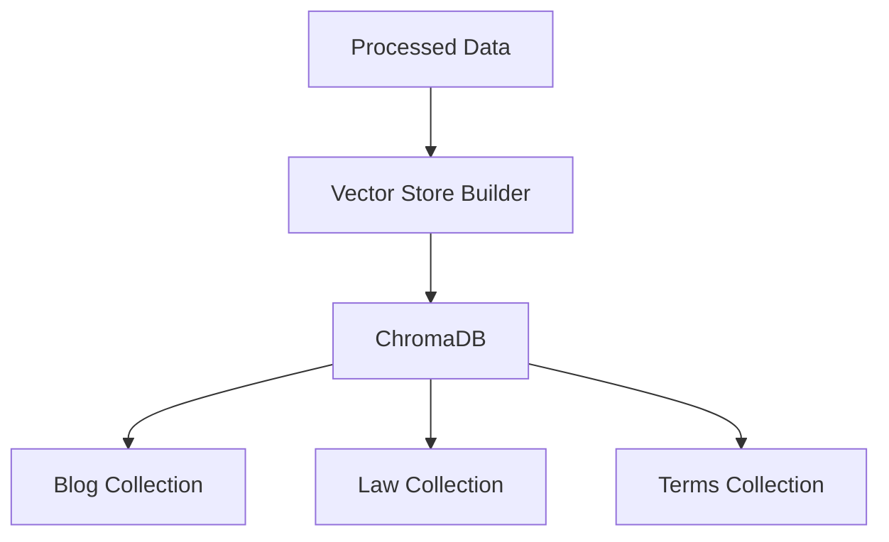

# Vector Store Tools

Tools for managing and creating vector stores for the Turkish Legal AI RAG system.

## Overview

The vector store system uses ChromaDB for efficient similarity search and retrieval. All vector stores are centralized in `backend/chroma_db/` for consistency.

## Architecture



## Collections

### 1. Blog Articles (`turkish_criminal_law_blog`)

- Blog content embeddings
- Metadata includes:
  - Title
  - Hierarchy level
  - TCK references
  - Legal terms
  - Topics
  - Source URL

### 2. Law Articles (`turkish_criminal_law`)

- TCK article embeddings
- Metadata includes:
  - Article number
  - Book
  - Part
  - Chapter

### 3. Legal Terms (`turkish_legal_terms`)

- Legal terminology embeddings
- Metadata includes:
  - Term
  - Type
  - Usage context

## Tools

### create_vector_store.py

Creates and manages vector store collections.

**Input**:

- `data/processed/criminal_law/hierarchical_criminal_law_articles.csv`
- `data/processed/criminal_law/processed_law.json`
- `data/processed/legal_terms/legal_terms.json`

**Output**: Vector store collections in `backend/chroma_db/`

```bash
python -m tools.vector_store.create_vector_store
```

## Configuration

### Embedding Model

```python
model_name = "sentence-transformers/paraphrase-multilingual-mpnet-base-v2"
```

### Storage Location

```python
CHROMA_DB_DIR = os.path.join("backend", "chroma_db")
```

## Usage

1. **Create Vector Store**

```bash
python -m tools.vector_store.create_vector_store
```

2. **Verify Collections**

```python
from chromadb import PersistentClient

client = PersistentClient(path="backend/chroma_db")
collection = client.get_collection("turkish_criminal_law_blog")
print(f"Documents in collection: {collection.count()}")
```

## Maintenance

### Regular Tasks

1. Backup vector stores
2. Verify collection integrity
3. Update embeddings when source data changes
4. Monitor storage usage

### Performance Optimization

1. Batch processing for large updates
2. Regular index optimization
3. Cache management
4. Query performance monitoring

## Error Recovery

1. **Backup Strategy**

   - Regular backups of ChromaDB directory
   - Version control for configuration
   - Metadata backups

2. **Recovery Steps**
   - Restore from backup
   - Rebuild specific collections
   - Verify data integrity

## Dependencies

- chromadb
- sentence-transformers
- pandas
- numpy

## Best Practices

1. **Data Quality**

   - Validate input data
   - Check embedding quality
   - Monitor similarity scores
   - Regular data audits

2. **Performance**

   - Use batch processing
   - Optimize chunk sizes
   - Monitor memory usage
   - Regular cleanup

3. **Maintenance**
   - Schedule regular backups
   - Monitor disk usage
   - Update embeddings
   - Clean unused data
