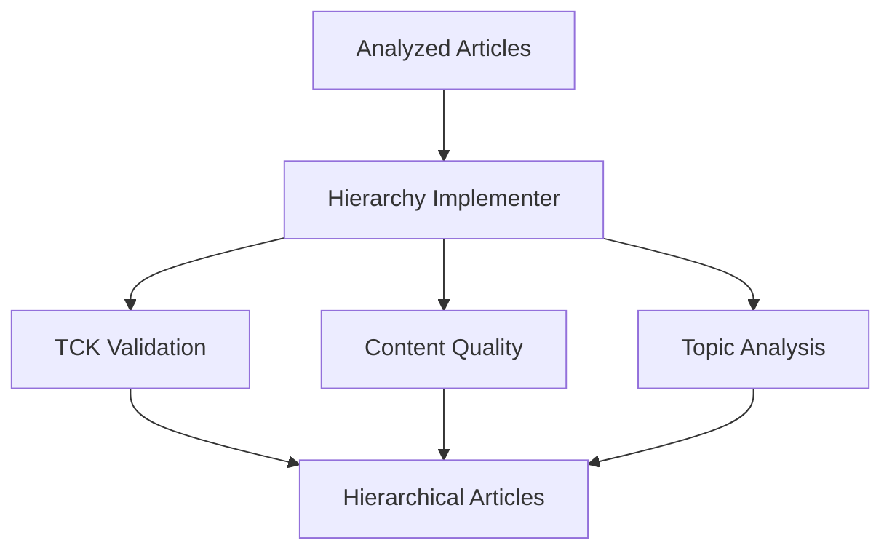

# Hierarchy Implementation Tools

Tools for implementing and validating the hierarchical structure of Turkish Criminal Law content.

## Overview

These tools manage the hierarchical relationships between blog articles and the Turkish Criminal Code (TCK), ensuring content validity and maintaining proper legal hierarchy.

## Architecture



## Components

### 1. TCK Hierarchy Structure

```python
tck_hierarchy = {
    'genel_hukumler': range(1, 76),     # Book 1: General Provisions
    'özel_hukumler': range(76, 344),    # Book 2: Special Provisions
    'son_hukumler': range(344, 347)     # Book 3: Final Provisions
}
```

### 2. Content Quality Rules

- Minimum content length
- Required legal terminology
- Procedural content validation
- Sanctions content validation

### 3. Validation Rules

- Content quality checks
- TCK reference validation
- Topic consistency validation
- Hierarchy level determination

## Tools

### implement_hierarchy.py

Implements hierarchical structure and validates content.

**Input**: `data/processed/criminal_law/analyzed_criminal_law_articles.csv`
**Output**:

- `data/processed/criminal_law/hierarchical_criminal_law_articles.csv`
- `data/processed/criminal_law/validation_results.json`

```bash
python -m tools.hierarchy.implement_hierarchy
```

## Hierarchy Levels

1. **General Provisions** (`genel_hukumler`)

   - TCK Articles 1-75
   - Basic principles
   - General rules

2. **Special Provisions** (`özel_hukumler`)

   - TCK Articles 76-343
   - Specific crimes
   - Punishments

3. **Final Provisions** (`son_hukumler`)

   - TCK Articles 344-346
   - Implementation rules
   - Effective dates

4. **Mixed Content** (`mixed`)

   - References to multiple sections
   - Cross-cutting topics
   - Comprehensive analysis

5. **Blog Only** (`blog_only`)
   - No direct TCK references
   - Commentary and analysis
   - Practical examples

## Validation Process

1. **Content Quality**

   ```python
   def _check_content_quality(article):
       # Validate minimum requirements
       # Check legal terminology
       # Verify content structure
   ```

2. **TCK References**

   ```python
   def _validate_tck_references(references):
       # Verify reference validity
       # Check hierarchy consistency
       # Validate cross-references
   ```

3. **Topic Analysis**
   ```python
   def _analyze_topics(content, references):
       # Extract main topics
       # Validate topic-reference consistency
       # Check hierarchy alignment
   ```

## Usage

1. **Run Hierarchy Implementation**

```bash
python -m tools.hierarchy.implement_hierarchy
```

2. **Check Validation Results**

```python
import json
with open('data/processed/criminal_law/validation_results.json', 'r') as f:
    results = json.load(f)
print(f"Articles with issues: {results['summary']['articles_with_issues']}")
```

## Error Handling

1. **Validation Errors**

   - Content quality issues
   - Invalid TCK references
   - Topic inconsistencies
   - Hierarchy conflicts

2. **Recovery Steps**
   - Log validation failures
   - Generate error reports
   - Provide correction suggestions
   - Track issue resolution

## Dependencies

- pandas
- json
- typing
- ast (for safe eval)

## Best Practices

1. **Content Validation**

   - Check all TCK references
   - Validate legal terminology
   - Ensure topic consistency
   - Maintain hierarchy rules

2. **Error Management**

   - Log all validation issues
   - Track error patterns
   - Document corrections
   - Update validation rules

3. **Documentation**
   - Keep validation rules updated
   - Document hierarchy changes
   - Track validation metrics
   - Maintain issue history
